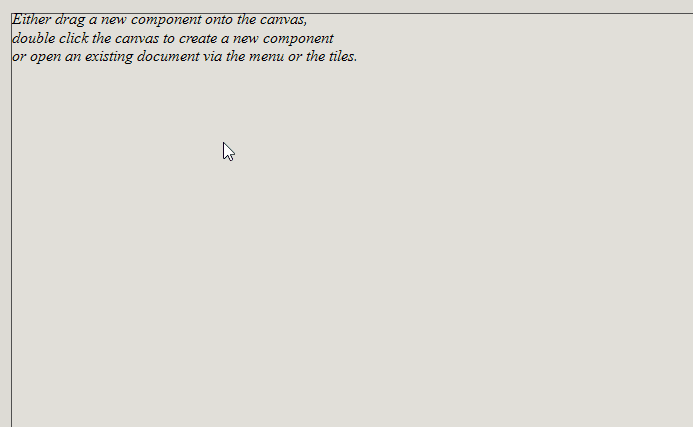
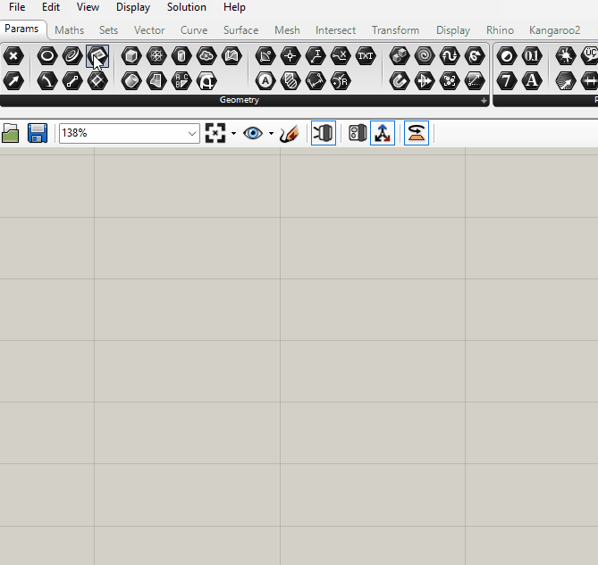
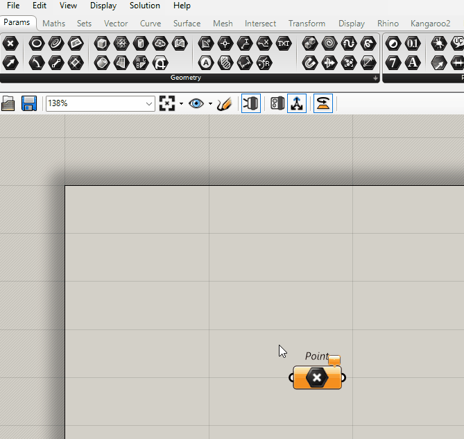
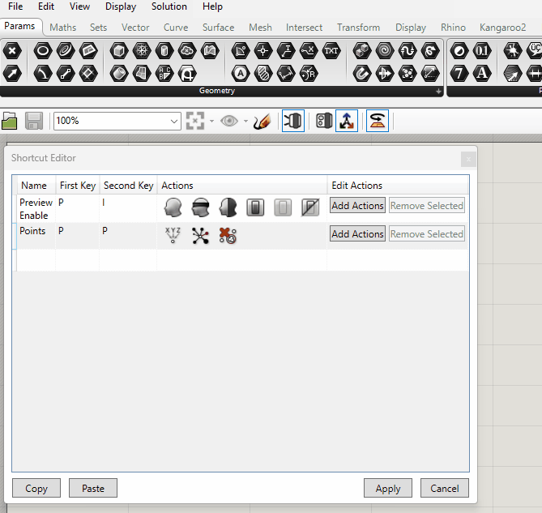

# Radial Menu

This is a plugin for you to create your custom radial menus in Grasshopper!

## Usage

For general usage, all you need to do is press the keys that you set and move the mouse to the item that you want to use, after that release your keys.

## Settings

The menu is under the main menu `Edit`. Forgive me about the ugly icon!

On this page, you can edit your menus!

You can edit the `Name` of the menu and the keys for it. Just activate that cell for the keys, and press the key you want to use.

If you want to add the custom objects in the grasshopper, please select it first, and do the steps that are shown on the gif.

If you want to add a menu item to the radial menu, just find it!

`Copy` and `Paste` are designed for sharing! If you have a great shortcut preset, please don't forget to share!

The changes only be applied when you click `Apply`. `Cancel` to reset the preset to the state that you opened this window.

Have fun fasting your Grasshopper experience!